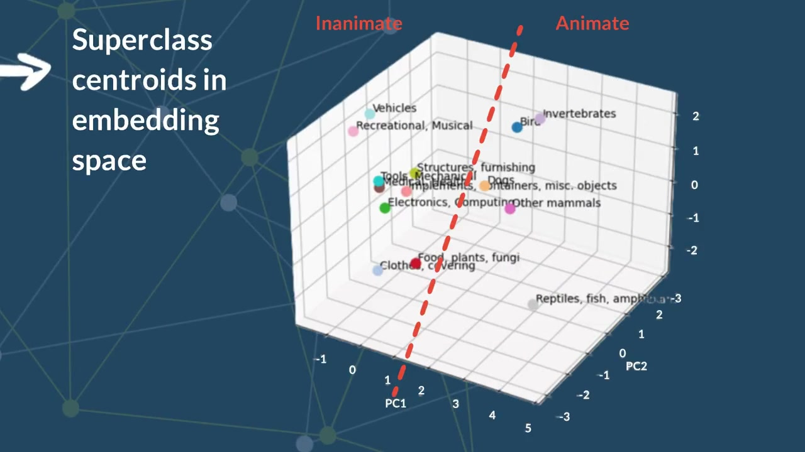
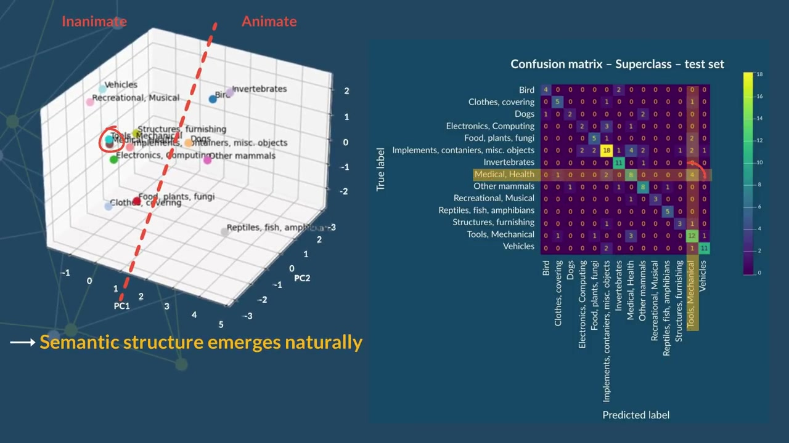
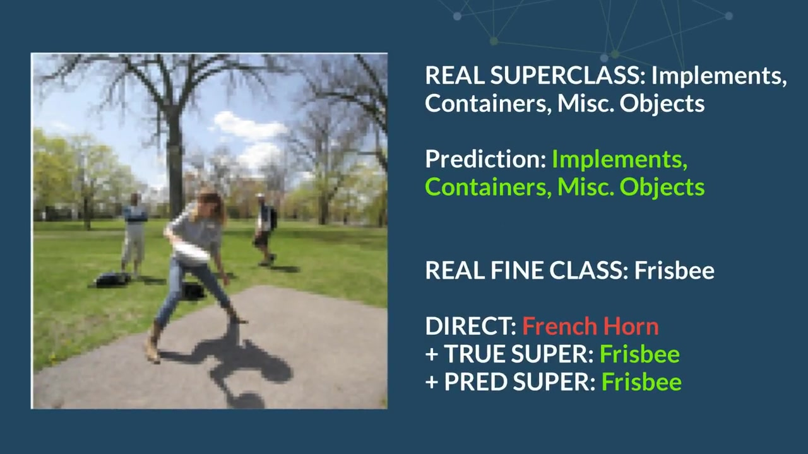
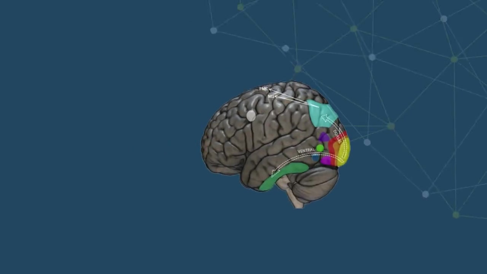
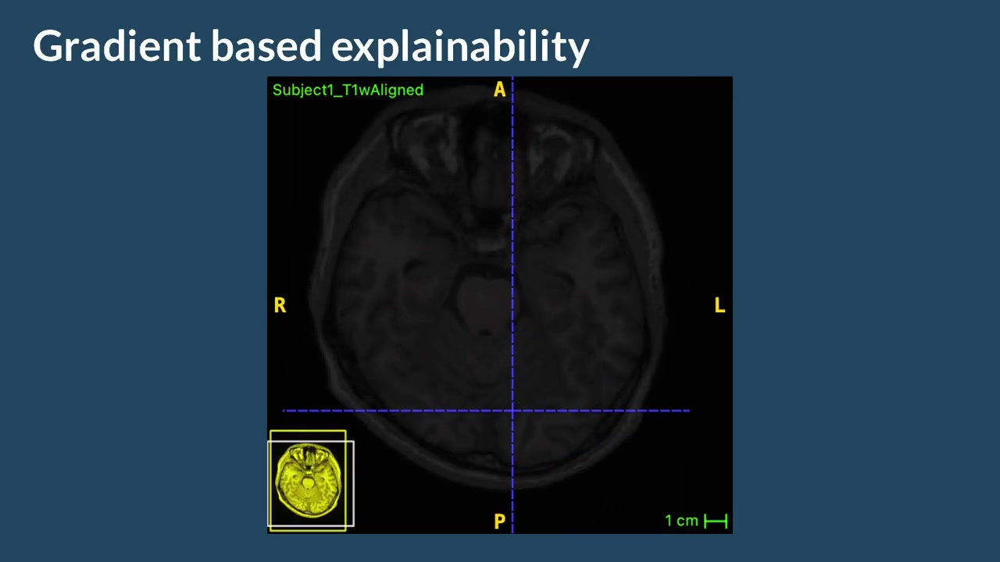

# Hierarchical fMRI Visual Decoding

Deep-learning project for decoding visual object categories from fMRI
activation patterns. The work compares direct fine-grained classification
with hierarchical approaches that incorporate true or predicted semantic
superclasses.

🏆 **Winner of the Neuroengineering course project competition** (Politecnico di Milano) — best-performing project among 5 groups working on Neural Decoding.

<p align="center">
  
  
  
</p>
<p align="center">
  <sub>Left to right: superclass centroids in embedding space, confusion matrix on the test set, example of a hierarchical prediction (direct vs. true-super vs. predicted-super).</sub>
</p>

<p align="center">
  
  
</p>
<p align="center">
  <sub>Left to right: anatomical ROI mapping on the brain surface, gradient-based explainability overlaid on the anatomical scan.</sub>
</p>

## Overview

The project analyses ROI-structured fMRI activation patterns and includes:

- exploratory analysis of fMRI responses and visual regions of interest;
- decoding of 14 semantic superclasses;
- direct classification of 150 fine-grained object categories;
- hierarchical classification conditioned on true superclass labels;
- hierarchical decoding using predicted superclass probabilities or learned
  embeddings;
- ROI feature recalibration with Squeeze-and-Excitation blocks;
- focal loss, class weighting and early stopping;
- confusion matrices and class-wise error analysis;
- ROI- and voxel-level interpretability;
- anatomical NIfTI mapping and 3D visualization;
- PCA and semantic-structure analyses.

## Repository structure

```text
nn_fMRI_project/
├── README.md
├── DATA_SOURCES.md
├── requirements.txt
├── requirements-supporting.txt
├── .python-version
├── .gitignore
│
├── notebooks/
│   ├── Hierarchical_fMRI_Decoding.ipynb
│   └── supporting/
│       ├── Superclass_CNN_Prototype.ipynb
│       └── Anatomical_3D_Visualization.ipynb
│
├── data/
│   ├── README.md
│   └── .gitkeep
│
├── assets/
│   └── demo_preview.jpg
├── media/
│   └── neural_decoding_demo.mp4
└── outputs/
    └── .gitkeep
```

## Main notebook

### `notebooks/Hierarchical_fMRI_Decoding.ipynb`

Primary PyTorch notebook containing the direct-versus-hierarchical
classification pipeline, model evaluation and interpretability analyses.

## Supporting notebooks

### `notebooks/supporting/Superclass_CNN_Prototype.ipynb`

Earlier TensorFlow/Keras prototype for superclass decoding and ROI-based
experiments.

### `notebooks/supporting/Anatomical_3D_Visualization.ipynb`

Supporting notebook for loading the legacy Subject 1 MATLAB file and
visualizing fMRI activity and ROI information in anatomical space.

## Data availability

**No data files are included in this repository.**

The notebooks expect a local `data/` directory containing:

```text
data/
├── god_with_superclass.pkl
├── roi_masks.npz
├── voxel_coords.npz
├── Subject1.mat
├── Subject1_T1wAligned.nii
├── imageID_training.csv
└── imageID_test.csv
```

The `.gitignore` file prevents these local files from being committed.

See:

- [`data/README.md`](data/README.md) for the role and expected structure of
  each file;
- [`DATA_SOURCES.md`](DATA_SOURCES.md) for dataset provenance and
  attribution.

The exact project-ready files are derived/prepared materials and must be
obtained separately or reconstructed from the underlying Generic Object
Decoding dataset.

## Data source

The underlying neuroimaging data originate from the **Generic Object
Decoding** dataset by Kamitani Lab, Tomoyasu Horikawa and Yukiyasu Kamitani.

Official dataset record:

https://figshare.com/articles/dataset/Generic_Object_Decoding/7387130

Official project page:

https://kamitanilab.github.io/GenericObjectDecoding/

Please cite:

> Horikawa, T., & Kamitani, Y. (2017). Generic decoding of seen and imagined
> objects using hierarchical visual features. *Nature Communications, 8*,
> 15037.

The official Figshare record lists the dataset under **CC BY 4.0**.

The GOD project does not publicly host the experimental visual images on its
server for copyright reasons. This repository therefore contains neither the
local data pickle nor the embedded stimulus images.

## Python version

Recommended version:

```text
Python 3.11.9
```

Python 3.11 provides a shared environment for the main PyTorch analysis and
the supporting TensorFlow/Keras notebook.

## Installation

### 1. Clone the repository

```bash
git clone <repository-url>
cd nn_fMRI_project
```

### 2. Create a virtual environment

macOS and Linux:

```bash
python3.11 -m venv .venv
source .venv/bin/activate
```

Windows:

```powershell
py -3.11 -m venv .venv
.venv\Scripts\activate
```

### 3. Install the main dependencies

```bash
python -m pip install --upgrade pip
python -m pip install -r requirements.txt
```

For the TensorFlow/Keras and 3D supporting notebooks:

```bash
python -m pip install -r requirements-supporting.txt
```

### 4. Add the data locally

Place the separately obtained project files inside `data/`, using the exact
filenames documented in `data/README.md`.

### 5. Start JupyterLab

Run Jupyter from the repository root:

```bash
jupyter lab
```

Then open:

```text
notebooks/Hierarchical_fMRI_Decoding.ipynb
```

## Compute device

The main notebook selects the available device in this order:

1. CUDA on a compatible NVIDIA GPU;
2. MPS on Apple Silicon;
3. CPU.

Full training may be slow on CPU. A GPU-enabled runtime is recommended for
reproducing the complete experiments.

For CUDA-specific PyTorch installation commands, use the official PyTorch
installation selector rather than changing the notebook code.

## Outputs

Generated NIfTI maps, NumPy arrays and model results should be saved under:

```text
outputs/
```

The directory contents are ignored by Git to avoid committing large
generated files.

## Demo

A compressed project demonstration is available here:

[`media/neural_decoding_demo.mp4`](media/neural_decoding_demo.mp4)

## Disclaimer

This repository is an academic neuroengineering and machine-learning
project. It is intended for research and educational use and is not a
clinical diagnostic system.
